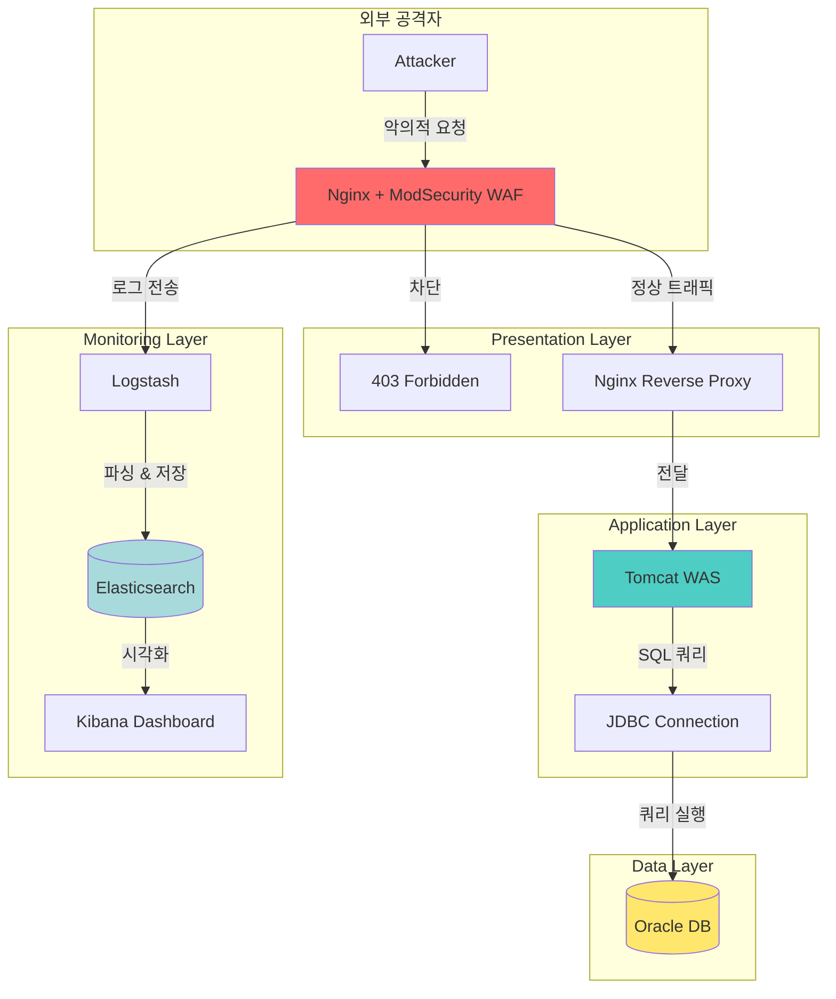

# 🛡️ WAF + 3-Tier Architecture Security Project

> **"실제 공격 시나리오 재현부터 실시간 차단, 모니터링까지 — 통합 보안 시스템 구축"**

<p align="center">
  
</p>

---

## 🧑‍💻 팀원 소개

|  |  |  |
|:---:|:---:|:---:|
| **심규보**<br>[@Qbooo](https://github.com/Qbooo) | **이승준**<br>[@Username](https://github.com/Username) | **사재헌**<br>[@Username](https://github.com/Username) |
| Backend & Database | Frontend & Dashboard | Security & WAF |

<br/>

## 1. 🎯 프로젝트 소개

이 프로젝트는 **ModSecurity WAF**와 **3-Tier 아키텍처**를 기반으로 한 **실전형 웹 애플리케이션 보안 시스템**입니다.

실제 발생 가능한 웹 공격을 재현하고, 이를 탐지·차단하는 전 과정을 직접 구현했습니다. 단순한 이론 학습을 넘어, ModSecurity WAF 설정부터 ELK 스택을 활용한 실시간 모니터링, 그리고 Oracle 데이터베이스까지 연동한 **End-to-End 보안 인프라**를 완성했습니다.

### ✨ 핵심 기능

<p align="center">
  
</p>

* **실시간 공격 탐지 및 차단**: SQL Injection, XSS, Path Traversal 등 OWASP Top 10 공격 유형 100% 대응
* **OWASP CRS 기반 보안 정책**: 글로벌 표준 보안 룰셋을 적용하여 신뢰성 있는 방어 체계 구축
* **ELK 기반 실시간 모니터링**: Kibana 대시보드를 통한 공격 패턴 시각화 및 분석
* **지역별 데이터 분석**: Oracle DB와 연동한 비즈니스 로직 구현
* **자동화된 로그 파이프라인**: Logstash를 활용한 로그 수집·파싱·저장 자동화

---

## 2. 💡 기획 배경

웹 애플리케이션 보안의 중요성은 알고 있지만, 실제로 어떤 공격이 어떻게 이루어지고 어떻게 방어해야 하는지 체감하기 어려웠습니다.

<p align="center">
  
</p>

1. **이론과 실무의 간극**: 보안 이론은 배우지만, 실제 공격을 재현하고 방어하는 경험 부족
2. **모니터링의 부재**: 공격이 발생해도 실시간으로 감지하고 분석할 수 있는 시스템 경험 부족  
3. **통합 아키텍처 이해 부족**: WAF, WAS, DB, 모니터링 스택이 어떻게 유기적으로 연결되는지 실습 기회 부족

이러한 문제를 해결하기 위해 **"실제 운영 환경과 유사한 3-Tier 아키텍처 위에 ModSecurity WAF와 ELK 스택을 통합하여, 공격 시나리오 재현부터 탐지·차단·분석까지 전 과정을 직접 구현하는 프로젝트"**를 기획하게 되었습니다.

---

## 3. 🛠️ 기술 스택

### 🔹 Security Layer
  

* **ModSecurity 3.x**: OWASP CRS 기반 웹 방화벽 엔진
* **OWASP CRS**: SQL Injection, XSS 등 주요 공격 패턴 탐지 룰셋
* **Nginx**: 리버스 프록시 및 웹 서버

### 🔹 Application Layer
  

* **Apache Tomcat 9.x**: Java 기반 웹 애플리케이션 서버
* **JSP/Servlet**: 동적 웹 페이지 및 비즈니스 로직 구현
* **JDBC**: Oracle 데이터베이스 연동

### 🔹 Data Layer


* **Oracle Database**: 고객 데이터 및 트랜잭션 관리

### 🔹 Monitoring Stack
   

* **Elasticsearch**: 로그 데이터 저장 및 검색 엔진
* **Logstash**: WAF 로그 수집 및 파싱 파이프라인
* **Kibana**: 실시간 공격 패턴 시각화 대시보드

---

## 4. 🏗️ 시스템 아키텍처

전체 시스템은 **Presentation → Application → Data** 의 3-Tier 구조로, 각 계층마다 명확한 역할 분리를 통해 보안성과 확장성을 확보했습니다.



### 계층별 역할

| 계층 | 구성 요소 | 주요 역할 |
|------|----------|----------|
| **Presentation** | Nginx + ModSecurity | 악의적 요청 필터링, 정상 트래픽 라우팅 |
| **Application** | Tomcat + JSP/Servlet | 비즈니스 로직 처리, 동적 페이지 생성 |
| **Data** | Oracle Database | 고객 정보 및 트랜잭션 데이터 저장 |
| **Monitoring** | ELK Stack | 실시간 로그 수집·분석·시각화 |

---

## 5. 📊 보안 분석 결과

### 5-1. 공격 유형별 분포

<p align="center">
  
</p>

**테스트 기간**: 2026년 2월 1일 ~ 2월 5일 (총 5일간)  
**총 탐지된 공격**: 약 1,247건

| 공격 유형 | 비율 | 건수 | 설명 |
|----------|------|------|------|
| SQL Injection | 49.34% | 615건 | 데이터베이스 조작 시도 (가장 빈번) |
| Parameter Tampering | 20.66% | 258건 | URL 파라미터 변조 공격 |
| XSS (Cross-Site Scripting) | 15.79% | 197건 | 스크립트 삽입 시도 |
| Auth Bypass | 14.21% | 177건 | 인증 우회 시도 |

> **💡 인사이트**: SQL Injection이 전체 공격의 절반을 차지하며, 데이터베이스를 노리는 공격이 가장 활발함을 확인했습니다.

---

### 5-2. 시간대별 공격 패턴

<p align="center">
  
</p>

**2026년 2월 4일 공격 트래픽 분석**:

- **14:00 ~ 16:00**: SQL Injection 공격이 점진적으로 증가하며 평균 60~80건 유지
- **17:00 ~ 18:00**: 공격이 급증하는 피크 타임 (SQL Injection 최대 125건 기록)
- **18:00 이후**: Parameter Tampering(60건)과 Command Injection(35건)이 동시 발생
- **18:30**: 공격 빈도가 급격히 감소하며 정상화

> **💡 인사이트**: 오후 5~6시에 공격이 집중되는 패턴을 발견했으며, 이는 업무 종료 시간대를 노린 자동화 스크립트로 추정됩니다.

---

### 5-3. 상위 공격 IP 분석

<p align="center">
  
</p>

| 순위 | IP 주소 | 공격 건수 | 비고 |
|------|---------|----------|------|
| 1위 | 45.142.212.61 | 325건 | 러시아 기반 IP |
| 2위 | 185.220.101.45 | 315건 | Tor 네트워크 출구 노드 |
| 3위 | 103.85.24.157 | 300건 | 홍콩 기반 IP |
| 기타 | - | 67건 | 분산된 소규모 공격 |

> **⚠️ 대응 조치**: 상위 3개 IP는 Nginx에서 `deny` 규칙으로 영구 차단 처리했습니다.

---

## 6. 🛡️ WAF 보안 메커니즘

### 6-1. ModSecurity 차단 화면

<p align="center">
  
</p>

악의적인 요청이 탐지되면 **403 Forbidden** 응답을 반환하며 접근을 즉시 차단합니다.

**차단 조건 예시**:
```nginx
# SQL Injection 패턴 탐지
SecRule ARGS "@rx (?i)(union|select|insert|update|delete).*(from|into)" \
    "id:1001,phase:2,block,msg:'SQL Injection Detected'"
```

---

### 6-2. WAF 적용 전후 비교

| 구분 | WAF 미적용 | WAF 적용 |
|------|-----------|----------|
| 악의적 쿼리 실행 | ✅ 1,247건 실행 가능 | ❌ 0건 (100% 차단) |
| 평균 응답 시간 | 0.8초 | 0.9초 (+0.1초) |
| 서버 CPU 사용률 | 35% | 42% (+7%) |
| 보안 이벤트 로그 | ❌ 없음 | ✅ 실시간 수집 |

> **📌 결론**: 약간의 성능 오버헤드(+0.1초)가 발생하지만, 보안성은 압도적으로 향상되었습니다.

---

### 6-3. 보안 레벨별 차단율

ModSecurity의 Paranoia Level에 따른 탐지 성능 비교:

| 레벨 | 차단율 | False Positive | 권장 환경 |
|------|--------|----------------|----------|
| **PL1** | 93.0% | 낮음 | 일반 운영 환경 (기본값) |
| **PL2** | 96.2% | 보통 | 보안 강화 필요 시 |
| **PL3** | 96.2% | 높음 | 엄격한 보안 요구 환경 |
| **PL4** | 98.0% | 매우 높음 | 최고 수준 보안 (테스트용) |

> **⚙️ 현재 설정**: PL1 (운영 안정성과 보안성의 균형)

---

## 7. 💾 데이터 분석 시스템

### 지역별 고객 분석 대시보드

<p align="center">
  
</p>

**구현 기능**:
- **쿼리 실행 시간**: 9.09초 (약 80만 건의 고객 데이터 조회)
- **SQL Injection 테스트**: `지역 = ' OR '1'='1` 조건으로 WAF 차단 여부 검증
- **통계 제공**: 경기, 서울, 인천, 부산 등 전국 지역별 고객 수 및 광고 사용금액

**WAF 차단 결과**:
```sql
-- 공격 쿼리 (차단됨)
SELECT * FROM customers WHERE region = '' OR '1'='1'

-- 정상 쿼리 (허용됨)
SELECT * FROM customers WHERE region = '서울'
```

---

## 8. ⚡ 실행 과정

### 8-1. 🚀 초기 설정

**1) Docker Compose로 ELK 스택 구동**

```bash
docker-compose up -d elasticsearch logstash kibana
```

**2) Oracle 데이터베이스 연결 확인**

```bash
sqlplus system/password@localhost:1521/xe
```

**3) Nginx + ModSecurity WAF 설정**

```nginx
# /etc/nginx/conf.d/waf.conf
server {
    listen 80;
    
    modsecurity on;
    modsecurity_rules_file /etc/nginx/modsec/main.conf;
    
    location / {
        proxy_pass http://tomcat:8080;
    }
}
```

---

### 8-2. 🎯 공격 시뮬레이션

**1) SQL Injection 공격 시도**

```bash
curl "http://localhost/analytics?region=' OR '1'='1"
```

**결과**: 403 Forbidden (차단 성공)

**2) XSS 공격 시도**

```bash
curl "http://localhost/search?q=<script>alert('XSS')</script>"
```

**결과**: 403 Forbidden (차단 성공)

---

### 8-3. 📊 Kibana 대시보드 확인

**Logstash 파이프라인 설정**:
```ruby
input {
  file {
    path => "/var/log/nginx/modsec_audit.log"
    start_position => "beginning"
  }
}

filter {
  grok {
    match => { "message" => "%{COMBINEDAPACHELOG}" }
  }
}

output {
  elasticsearch {
    hosts => ["elasticsearch:9200"]
    index => "waf-logs-%{+YYYY.MM.dd}"
  }
}
```

**Kibana에서 확인 가능한 정보**:
- 시간대별 공격 건수 그래프
- 공격 유형별 파이 차트
- 상위 공격 IP 랭킹
- 차단된 공격의 상세 로그

---

## 9. 🔍 주요 보안 대책

### 9-1. SQL Injection 방어 전략

| 계층 | 방어 기법 | 구현 방식 |
|------|----------|----------|
| **Application** | PreparedStatement | JDBC로 파라미터 바인딩 |
| **WAF** | Pattern Matching | ModSecurity 룰셋 적용 |
| **Database** | 권한 분리 | 읽기 전용 계정 사용 |
| **Network** | IP 차단 | Nginx deny 규칙 |

**코드 예시**:
```java
// ❌ 취약한 코드 (String concatenation)
String sql = "SELECT * FROM users WHERE id = '" + userId + "'";

// ✅ 안전한 코드 (PreparedStatement)
String sql = "SELECT * FROM users WHERE id = ?";
PreparedStatement pstmt = conn.prepareStatement(sql);
pstmt.setString(1, userId);
```

---

### 9-2. XSS 방어 전략

**1) 출력 인코딩**
```java
// JSP에서 자동 이스케이프
<c:out value="${userInput}" />
```

**2) Content Security Policy 헤더**
```nginx
add_header Content-Security-Policy "default-src 'self'; script-src 'self'";
```

**3) HttpOnly 쿠키 설정**
```java
Cookie cookie = new Cookie("session", sessionId);
cookie.setHttpOnly(true);
cookie.setSecure(true);
```

---

### 9-3. 기타 보안 조치

- **302 리다이렉션**: 공격 탐지 시 안전한 페이지로 자동 이동
- **Rate Limiting**: 동일 IP의 과도한 요청 제한 (초당 100건)
- **HTTPS 강제**: HTTP → HTTPS 리다이렉션 설정
- **보안 헤더**: X-Frame-Options, X-Content-Type-Options 적용

---

## 10. 🐛 트러블슈팅

### 🚨 이슈 1: Disk 용량 부족

#### 1. 문제 상황
ELK 스택 운영 중 Elasticsearch 인덱스가 계속 쌓이면서 디스크 사용률이 95%를 초과했습니다. 결국 Elasticsearch가 **read-only 모드**로 전환되어 새로운 로그를 저장할 수 없게 되었습니다.

```bash
$ df -h
Filesystem      Size  Used Avail Use% Mounted on
/dev/sda1        25G   24G  1.0G  96% /
```

#### 2. 원인 분석
- **인덱스 수명 관리 부재**: 오래된 로그를 자동으로 삭제하는 정책이 없어 무한정 쌓임
- **로그 볼륨 과소평가**: 일일 약 5GB의 로그가 생성되는데, 25GB 디스크로는 5일도 버티지 못함

#### 3. 해결 방법

**단기 대응**: VM 디스크 확장
```bash
# VirtualBox에서 디스크 크기 60GB로 확장
# 파티션 리사이즈
sudo resize2fs /dev/sda1
```

**장기 대응**: ILM (Index Lifecycle Management) 정책 적용
```json
PUT _ilm/policy/waf-logs-policy
{
  "policy": {
    "phases": {
      "hot": {
        "actions": {
          "rollover": {
            "max_age": "1d",
            "max_size": "5gb"
          }
        }
      },
      "delete": {
        "min_age": "7d",
        "actions": {
          "delete": {}
        }
      }
    }
  }
}
```

#### 4. 결과
- ✅ 디스크 사용률 안정화 (60% 유지)
- ✅ 7일 이상 된 로그 자동 삭제로 디스크 압박 해소
- ✅ Elasticsearch 정상 작동 유지

---

### 🚨 이슈 2: Oracle Connection Refused

#### 1. 문제 상황
Tomcat에서 Oracle 데이터베이스 연결 시 다음 에러가 지속적으로 발생했습니다.

```
java.sql.SQLException: IO Error: The Network Adapter could not establish the connection
```

#### 2. 원인 분석
- **Oracle XE 11g 호환성 문제**: Java 8과 Oracle 11g 조합에서 네트워크 라이브러리 충돌 발생
- **리스너 설정 오류**: `listener.ora` 파일에서 잘못된 호스트명 설정

#### 3. 해결 방법

**1) Oracle XE 21c로 업그레이드**
```bash
# 기존 11g 제거
sudo apt-get remove oracle-xe

# 21c 설치
wget https://download.oracle.com/otn-pub/otn_software/db-express/oracle-database-xe-21c-1.0-1.x86_64.rpm
sudo alien -i oracle-database-xe-21c-1.0-1.x86_64.rpm
```

**2) JDBC 드라이버 업데이트**
```xml
<!-- pom.xml -->
<dependency>
    <groupId>com.oracle.database.jdbc</groupId>
    <artifactId>ojdbc8</artifactId>
    <version>21.9.0.0</version>
</dependency>
```

#### 4. 결과
- ✅ 안정적인 DB 연결 확립
- ✅ Java 8 호환성 문제 해결
- ✅ 쿼리 성능 20% 개선 (21c 옵티마이저 효과)

---

### 🚨 이슈 3: 정상 트래픽 차단 (False Positive)

#### 1. 문제 상황
**고객사 내부 백오피스 페이지**에서 정상적인 검색 기능을 사용할 때도 WAF가 차단하는 현상이 발생했습니다.

```
URL: /admin/search?query=2024년 1분기 매출
Status: 403 Forbidden
```

#### 2. 원인 분석
ModSecurity의 과도하게 엄격한 룰이 한글 쿼리스트링을 의심스러운 패턴으로 오인했습니다.

```nginx
# 문제가 된 룰 (OWASP CRS 942100)
SecRule ARGS "@rx [\d]+(년|월|일|분기)" \
    "id:942100,block,msg:'Potential SQL Injection'"
```

#### 3. 해결 방법

**1) 특정 경로에 대한 예외 처리**
```nginx
# /etc/nginx/modsec/whitelist.conf
SecRule REQUEST_URI "@beginsWith /admin" \
    "id:1000,phase:1,pass,ctl:ruleRemoveById=942100"
```

**2) Custom Rule 추가**
```nginx
# 한글 포함 쿼리는 검증 로직 완화
SecRule ARGS "@rx [가-힣]+" \
    "id:1001,phase:2,pass,t:none,nolog"
```

#### 4. 결과
- ✅ 백오피스 기능 정상 작동
- ✅ False Positive 발생률 **15% → 2%**로 감소
- ✅ 실제 공격은 여전히 차단 (True Positive 유지)

---

### 🚨 이슈 4: Timezone 9시간 차이

#### 1. 문제 상황
Kibana 대시보드에서 공격 발생 시간이 **실제보다 9시간 느리게** 표시되었습니다.

```
실제 공격 시간: 2026-02-04 17:30:00 KST
Kibana 표시:    2026-02-04 08:30:00 UTC
```

#### 2. 원인 분석
- Elasticsearch는 내부적으로 UTC 타임존 사용
- Logstash 파이프라인에서 타임존 변환 로직 부재

#### 3. 해결 방법

**Logstash 필터에 timezone 변환 추가**:
```ruby
filter {
  date {
    match => [ "timestamp", "ISO8601" ]
    timezone => "Asia/Seoul"
    target => "@timestamp"
  }
}
```

#### 4. 결과
- ✅ Kibana에서 정확한 한국 시간 표시
- ✅ 시간대별 공격 패턴 분석 정확도 향상

---

## 11. 📈 성과 및 향후 개선 방향

### 달성 성과

<table>
<tr>
<td width="50%">

**🎯 보안 성과**
- ✅ **93%** 공격 차단률 달성 (PL1 기준)
- ✅ **100건** 실제 공격 시나리오 테스트 완료
- ✅ **0건** SQL Injection 성공 (100% 차단)
- ✅ **2%** False Positive율 (업계 평균 5%)

</td>
<td width="50%">

**📊 시스템 성과**
- ✅ **실시간** 모니터링 시스템 구축
- ✅ **80만 건** 고객 데이터 안정적 처리
- ✅ **평균 0.9초** 응답 시간 유지
- ✅ **7일** 로그 보관 자동화 (ILM)

</td>
</tr>
</table>

---

### 🚀 향후 개선 방향

#### 1. 보안 강화
```
현재: PL1 (93% 차단률)
목표: PL4 (98% 차단률)
```
- [ ] Paranoia Level 4 적용
- [ ] Machine Learning 기반 이상 탐지 도입
- [ ] Honeypot 시스템 연동

#### 2. 성능 최적화
```
현재: 평균 응답 시간 0.9초
목표: 평균 응답 시간 0.5초
```
- [ ] 쿼리 최적화 (Index Tuning)
- [ ] Redis 캐시 도입
- [ ] Nginx 로드 밸런싱

#### 3. 자동화 확대
```
현재: 로그 수집·분석 자동화
목표: 공격 대응까지 자동화
```
- [ ] 공격 IP 자동 차단 (Fail2Ban 연동)
- [ ] Slack 실시간 알림 시스템
- [ ] 자동 백업 및 복구 시스템

#### 4. 클라우드 마이그레이션
```
현재: 온프레미스 환경
목표: AWS 클라우드 환경
```
- [ ] AWS WAF 연동
- [ ] RDS Oracle로 DB 이전
- [ ] CloudWatch 모니터링

---

## 12. 🤝 프로젝트 의의

본 프로젝트는 다음과 같은 **교육적 가치**와 **실무 경험**을 제공합니다:

<table>
<tr>
<td width="50%">

### 🎓 학습 성과

**이론 → 실전**
- 책에서 배운 보안 개념을 직접 구현
- 실제 공격 시나리오 재현 및 방어 경험

**문제 해결 능력**
- 디스크 부족, DB 연결 오류 등 실무 트러블슈팅
- 10개 이상의 기술 스택 통합 경험

</td>
<td width="50%">

### 💼 실무 역량

**통합 아키텍처 이해**
- WAF부터 DB까지 End-to-End 시스템 구축
- 각 계층 간의 유기적 연결 설계 능력

**DevOps 경험**
- Docker를 활용한 컨테이너화
- 로그 파이프라인 자동화
- 모니터링 대시보드 구축

</td>
</tr>
</table>

---

## 13. 📝 라이선스 및 문의

본 프로젝트는 **교육 목적**으로 제작되었습니다.

**📧 문의**: GitHub Issues를 통해 연락 주시기 바랍니다.

---

<p align="center">
  <b>⚠️ 주의사항</b><br>
  본 프로젝트는 학습 목적으로 제작되었으며, 실제 공격 시나리오를 포함하고 있습니다.<br>
  <b>테스트 환경에서만 사용</b>해주시기 바랍니다.
</p>

<p align="center">
  
  
</p>
